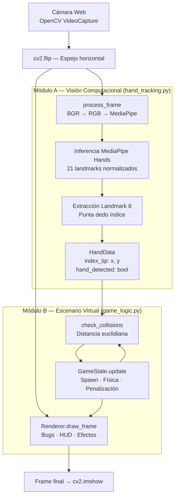
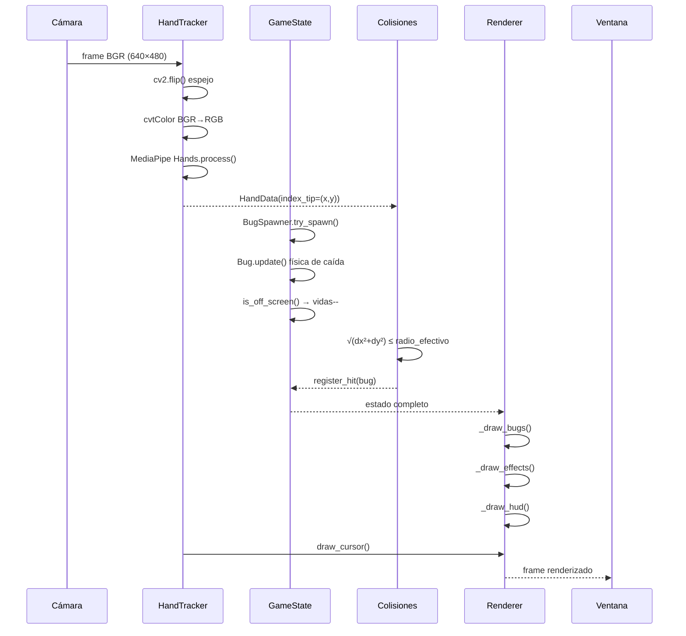
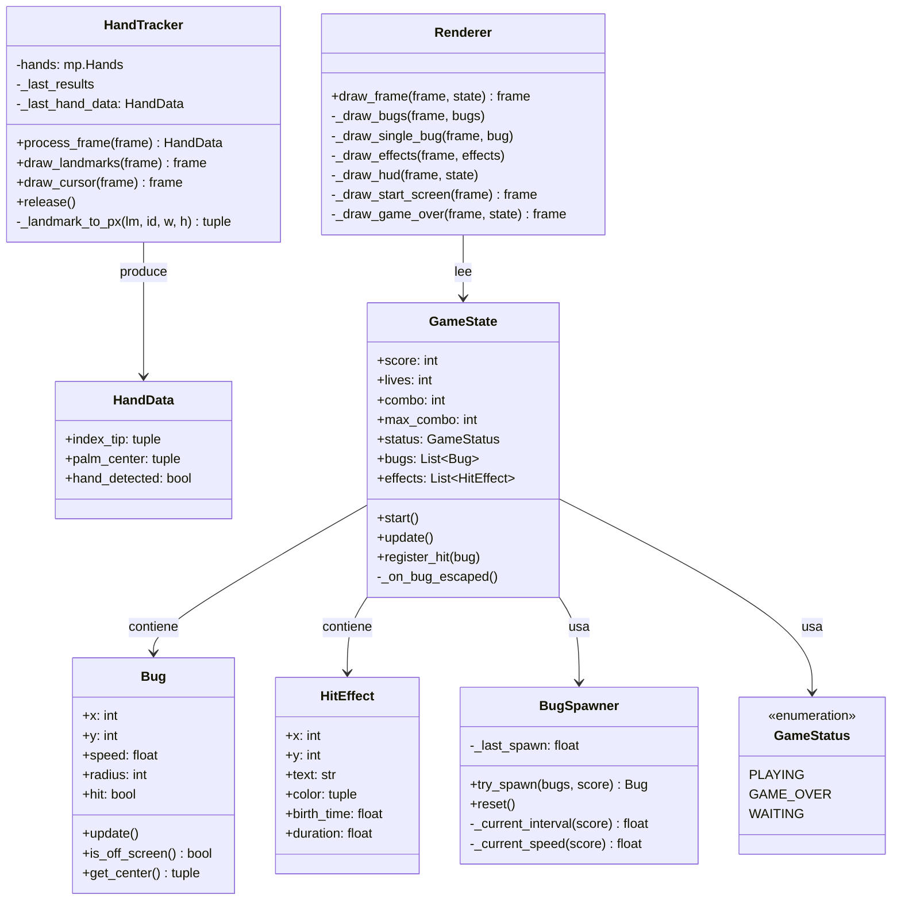
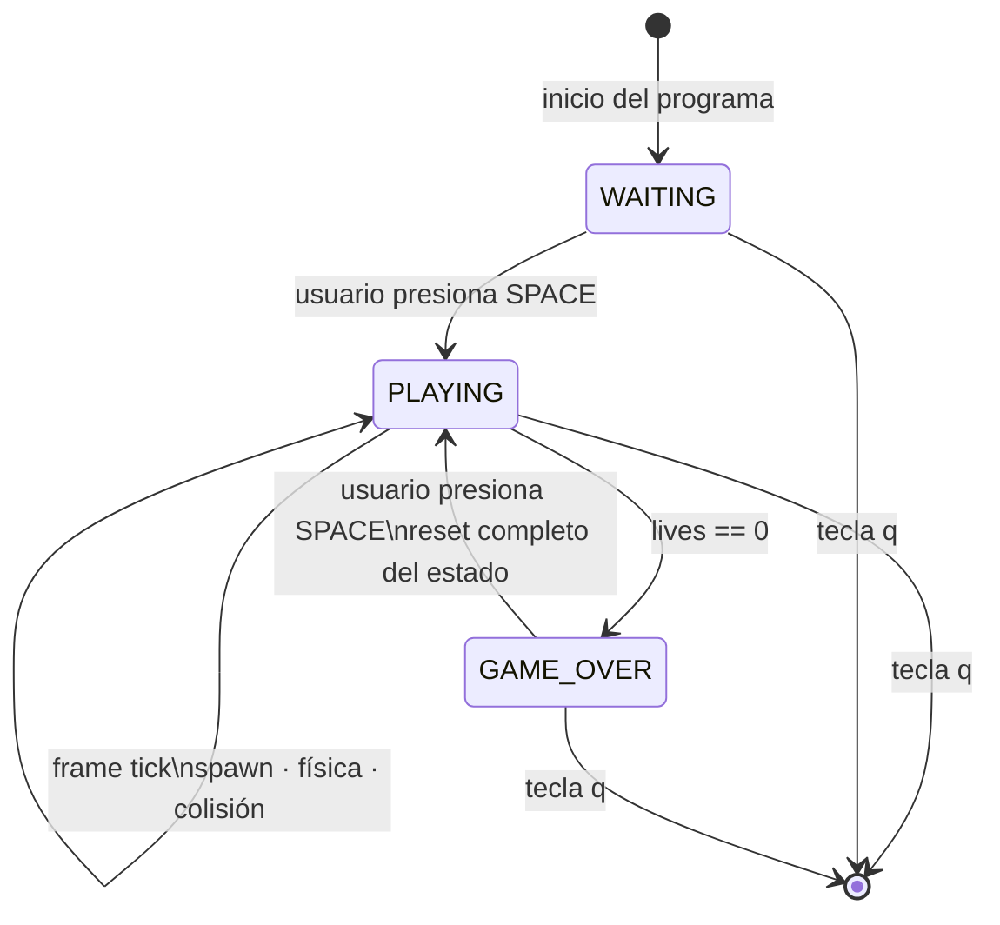
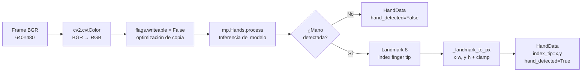
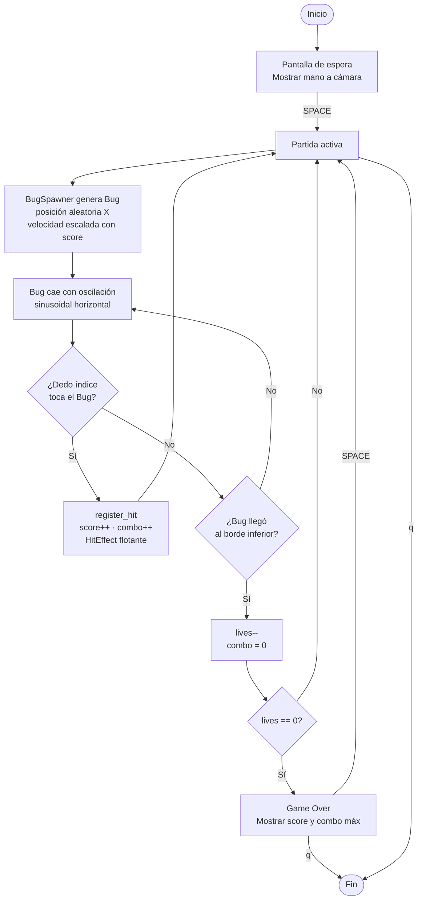

# Code Ninja: Bug Smasher

> Laboratorio 10 — Clasificación y Reconocimiento  
> Asignatura: Computación Gráfica, Visión Computacional y Multimedia  
> Universidad Nacional de San Agustín (UNSA)

Juego interactivo en tiempo real donde el usuario destruye "Bugs" de software usando únicamente sus manos frente a la cámara web. El sistema detecta la posición del dedo índice mediante MediaPipe Hands y evalúa colisiones euclidianas contra entidades animadas generadas proceduralmente en el escenario virtual.

---

## Tabla de Contenidos

1. [Demo y Capturas](#demo-y-capturas)
2. [Arquitectura del Sistema](#arquitectura-del-sistema)
3. [Módulo A — Visión Computacional](#módulo-a--visión-computacional-hand_trackingpy)
4. [Módulo B — Escenario Virtual](#módulo-b--escenario-virtual-game_logicpy)
5. [Integración y Colisiones](#integración-y-colisiones-mainpy)
6. [Tecnologías y Dependencias](#tecnologías-y-dependencias)
7. [Instalación y Ejecución](#instalación-y-ejecución)
8. [Mecánicas de Juego](#mecánicas-de-juego)
9. [Cuestionario Técnico](#cuestionario-técnico)

---

## Demo y Capturas

### Video demostrativo

> 📹 **[PLACEHOLDER — Insertar enlace al video demostrativo aquí]**

---

### Pantalla de inicio

> 📸 **[PLACEHOLDER — Captura de la pantalla de inicio con overlay semitransparente]**

---

### Partida en curso

> 📸 **[PLACEHOLDER — Captura del juego activo: bugs cayendo, cursor verde sobre dedo índice, HUD con puntaje y vidas]**

---

### Efecto de impacto y combo

> 📸 **[PLACEHOLDER — Captura mostrando el texto flotante "+2 x3!" al destruir bugs en cadena]**

---

### Pantalla de Game Over

> 📸 **[PLACEHOLDER — Captura de la pantalla de Game Over con score final y combo máximo]**

---

### Debug de colisión (tecla `d`)

> 📸 **[PLACEHOLDER — Captura con el círculo amarillo de radio de colisión visible alrededor del cursor]**

---

## Arquitectura del Sistema

El sistema se divide en dos módulos desacoplados que se comunican a través de estructuras de datos simples, siguiendo el principio de **separación de responsabilidades**:



---

### Flujo de datos por frame



---

### Jerarquía de clases



---

### Máquina de estados del juego



---

## Módulo A — Visión Computacional (`hand_tracking.py`)

### Descripción

Encapsula **MediaPipe Hands** en una clase orientada a objetos con interfaz limpia. El módulo es completamente independiente de la lógica del juego; su única responsabilidad es transformar un frame de cámara en coordenadas de interacción.

### Pipeline de procesamiento



### Landmarks utilizados

MediaPipe Hands devuelve **21 landmarks** en coordenadas normalizadas `[0, 1]`. El proyecto utiliza:

| ID | Landmark | Uso |
|----|----------|-----|
| 8  | `INDEX_FINGER_TIP` | Puntero principal de juego |
| 9  | `MIDDLE_FINGER_MCP` | Aproximación al centro de palma (reservado) |

### Conversión de coordenadas normalizadas a píxeles

```python
x_px = int(landmark.x * frame_width)   # coord X normalizada → píxeles
y_px = int(landmark.y * frame_height)  # coord Y normalizada → píxeles

# Clamp para garantizar que no salga del frame
x_px = max(0, min(x_px, frame_width  - 1))
y_px = max(0, min(y_px, frame_height - 1))
```

### Parámetros del modelo

| Parámetro | Valor | Justificación |
|-----------|-------|---------------|
| `max_num_hands` | 1 | Menor carga computacional; el juego requiere un único puntero |
| `min_detection_confidence` | 0.70 | Equilibrio entre sensibilidad y falsos positivos |
| `min_tracking_confidence` | 0.60 | Ligeramente menor para mantener tracking fluido en movimiento rápido |
| `static_image_mode` | False | Modo video: activa el tracker interno de MediaPipe entre frames |

---

## Módulo B — Escenario Virtual (`game_logic.py`)

### Descripción

Implementa todas las entidades del juego, la lógica de dificultad progresiva y el sistema de renderizado. El `Renderer` es **stateless** (sin estado interno): recibe el `GameState` y produce el frame. Esto garantiza que el mismo estado siempre produzca la misma imagen.

### Física de caída de los Bugs

Cada `Bug` implementa **caída libre con oscilación sinusoidal horizontal**, simulando el vuelo irregular de un insecto:

```python
# Caída vertical
self.y += self.speed  # píxeles/frame, constante

# Oscilación horizontal
self.x += int(
    self._wobble_amp
    * math.sin(self._wobble_freq * self._frame_count + self._wobble_phase)
)
```

Los parámetros `_wobble_amp`, `_wobble_freq` y `_wobble_phase` son **aleatorios por instancia**, garantizando que cada bug tenga una trayectoria única.

### Dificultad progresiva

`BugSpawner` escala dos variables con el puntaje del jugador:

```python
# Intervalo entre spawns (decrece → más bugs)
intervalo = max(SPAWN_INTERVAL - score * 0.025, MIN_SPAWN_INT)
# Rango: 1.4s (inicio) → 0.45s (máximo)

# Velocidad de caída (aumenta → más rápido)
speed = random.uniform(
    BASE_SPEED_MIN + score * SPEED_SCALE,
    BASE_SPEED_MAX + score * SPEED_SCALE
)
# Rango inicial: [2.5, 4.5] px/frame → escala con el puntaje
```

### Sistema de combo y puntuación

```python
puntos = 1 + (combo // 3)  # cada 3 kills consecutivos, +1 punto extra
```

| Combo | Puntos por kill |
|-------|----------------|
| 0–2   | 1              |
| 3–5   | 2              |
| 6–8   | 3              |
| 9–11  | 4              |

El combo se **rompe** cuando un bug escapa al borde inferior.

### Efectos visuales con desvanecimiento temporal

Los `HitEffect` calculan su opacidad y posición vertical en función del tiempo transcurrido desde su creación, sin almacenar estado intermedio:

```python
age   = time.time() - eff.birth_time          # segundos transcurridos
alpha = max(0.0, 1.0 - age / eff.duration)    # 1.0 → 0.0 lineal
py    = int(eff.y) - 20 - int(age * 60)       # sube 60px/segundo
color = (int(R * alpha), int(G * alpha), int(B * alpha))
```

---

## Integración y Colisiones (`main.py`)

### Matemática de colisión bidimensional

El sistema evalúa colisión entre el cursor (punta del dedo índice) y cada Bug usando **distancia euclidiana**. Una colisión se registra cuando la distancia es menor o igual al radio efectivo del bug:

$$d = \sqrt{(\,x_{cursor} - x_{bug}\,)^2 + (\,y_{cursor} - y_{bug}\,)^2} \leq r_{bug} \cdot k$$

donde $k = 1.15$ es un factor de tolerancia que compensa la imprecisión natural del movimiento de la mano.

```python
dx = cursor_x - bug.x
dy = cursor_y - bug.y
distancia = math.sqrt(dx * dx + dy * dy)      # distancia euclidiana

if distancia <= BUG_RADIUS * COLLISION_TOLERANCE:
    state.register_hit(bug)
```

### Ventajas de la distancia euclidiana para este problema

- **Isótropa**: detecta la colisión con igual sensibilidad en todas las direcciones, lo que es consistente con la forma circular de los bugs.
- **O(n)**: la evaluación es lineal respecto al número de bugs activos (máx. 7), sin estructura de datos adicional.
- **Sin artefactos de esquina**: a diferencia de una colisión AABB (Axis-Aligned Bounding Box), no genera falsas colisiones en las esquinas de un rectángulo imaginario.

### Orden de renderizado por frame

```
1. cap.read()           → frame crudo BGR
2. cv2.flip()           → espejo horizontal
3. HandTracker          → inferencia MediaPipe (HandData)
4. GameState.update()   → física, spawn, penalizaciones
5. check_collisions()   → evaluación euclidiana
6. Renderer.draw_frame()→ bugs + efectos + HUD
7. draw_landmarks()     → esqueleto de mano (debug)
8. draw_cursor()        → círculo verde encima de todo
9. cv2.imshow()         → presentación al usuario
```

El cursor se dibuja **después** del Renderer para que siempre quede visible sobre cualquier elemento del juego.

---

## Tecnologías y Dependencias

| Librería | Versión | Rol en el proyecto |
|----------|---------|-------------------|
| `opencv-python` | 4.10.0.84 | Captura de video, renderizado, funciones de dibujo, manejo de ventana |
| `mediapipe` | 0.10.14 | Modelo pre-entrenado de detección y tracking de manos (21 landmarks) |
| `numpy` | 1.26.4 | Manipulación de matrices de imagen, operaciones sobre frames |
| `math` | stdlib | Cálculo de distancia euclidiana, funciones trigonométricas para oscilación |
| `random` | stdlib | Generación de posiciones y velocidades aleatorias de bugs |
| `time` | stdlib | Control de intervalos de spawn y duración de efectos visuales |
| `dataclasses` | stdlib | Estructuras de datos tipadas (`HandData`, `HitEffect`) |
| `enum` | stdlib | Máquina de estados del juego (`GameStatus`) |

### ¿Por qué MediaPipe Hands?

MediaPipe Hands es un modelo pre-entrenado de Google que detecta **21 landmarks 3D** de la mano en tiempo real. Sus ventajas para este proyecto son:

- **Ejecución en CPU**: no requiere GPU, funciona en cualquier laptop con cámara web.
- **Alta precisión**: entrenado sobre millones de imágenes de manos en distintas condiciones de iluminación.
- **Baja latencia**: optimizado para inferencia en tiempo real (~30ms por frame en CPU).
- **API simple**: devuelve coordenadas normalizadas listas para escalar a cualquier resolución.

---

## Instalación y Ejecución

### Requisitos

- Python 3.8 o superior
- Cámara web conectada
- Sistema operativo: Windows 10/11, Linux, macOS

### Pasos

```bash
# 1. Clonar el repositorio
git clone <URL_DEL_REPOSITORIO>
cd code-ninja-bug-smasher

# 2. Crear y activar el entorno virtual
python -m venv venv

# Windows
venv\Scripts\activate
# Linux / macOS
source venv/bin/activate

# 3. Instalar dependencias
pip install -r requirements.txt

# 4. Ejecutar el juego
python src/main.py
```

### Controles

| Tecla | Acción |
|-------|--------|
| `SPACE` | Iniciar partida / Reiniciar tras Game Over |
| `d` | Toggle del círculo de debug de colisión |
| `q` | Salir y liberar recursos |

### Tests individuales de módulos

```bash
# Test del Módulo A: verifica cámara y detección de mano
python src/hand_tracking.py

# Test del Módulo B: verifica lógica y gráficos sin cámara
python src/game_logic.py
```

---

## Mecánicas de Juego



---

## Cuestionario Técnico

### Pregunta 1: ¿Qué algoritmos de clasificación/reconocimiento utiliza el sistema y cuáles son sus limitaciones?

El sistema usa el modelo **MediaPipe Hands**, que internamente implementa una **red neuronal convolucional (CNN)** en dos etapas:

1. **Detector de palma** (BlazePalm): localiza la región de la mano en el frame completo usando una arquitectura similar a SSD (Single Shot Detector).
2. **Estimador de landmarks** (Hand Landmark Model): dentro del recorte de la palma, regresa las coordenadas 3D de los 21 landmarks usando una CNN ligera optimizada para dispositivos de baja potencia.

**Limitaciones identificadas:**

- **Oclusión**: si el dedo índice queda oculto detrás de otros dedos, el landmark 8 se estima con menor precisión.
- **Iluminación**: el modelo degrada su rendimiento con luz trasera intensa (contraluz) o ambientes muy oscuros.
- **Manos similares al fondo**: en fondos con tonos de piel similares, el detector de palma puede fallar.
- **Latencia acumulada**: en CPU con frames grandes (>720p), la inferencia supera los 33ms del frame target de 30 FPS.

### Pregunta 2: ¿Qué problemas de reconocimiento en tiempo real presenta la detección de colisiones y cómo se mitigan?

El principal problema es el **desfase temporal (lag)** entre el movimiento físico de la mano y las coordenadas detectadas. Si el usuario mueve la mano rápidamente para golpear un bug, existe una ventana de ~30-100ms donde el dedo ya pasó sobre el bug pero el sistema aún no procesó ese frame.

**Mitigaciones implementadas:**

| Problema | Solución aplicada |
|----------|-------------------|
| Latencia de detección | Factor de tolerancia `k = 1.15` sobre el radio de colisión, ampliando el área efectiva |
| Movimiento brusco | Detección por **posición puntual** (no por velocidad), evaluada en cada frame a 30 FPS |
| Falsos negativos | Radio efectivo = `BUG_RADIUS × 1.15 = ~36.8px`, significativamente mayor que el cursor visual |
| Coordenadas fuera del frame | Clamp en `_landmark_to_px()`: `max(0, min(x, w-1))` |

Una mejora futura sería implementar **predicción de trayectoria** del dedo usando un filtro de Kalman, anticipando la posición en el siguiente frame para compensar la latencia de MediaPipe.

---

## Estructura del Repositorio

```
code-ninja-bug-smasher/
├── assets/
│   └── bugs/              # PNGs con canal alfa (Ilación 5)
├── src/
│   ├── hand_tracking.py   # Módulo A — Visión Computacional
│   ├── game_logic.py      # Módulo B — Escenario Virtual
│   └── main.py            # Punto de entrada e integración
├── .gitignore
├── requirements.txt
└── README.md
```

---

## Historial de Ilaciones (Sprints)

| Ilación | Descripción | Commit |
|---------|-------------|--------|
| 1 | Setup: entorno virtual, dependencias, `.gitignore` | `feat: Ilación 1 - setup inicial del proyecto` |
| 2 | `hand_tracking.py`: clase `HandTracker` + test de cámara | `feat(hand_tracking): clase HandTracker con MediaPipe y test de cámara` |
| 3 | `game_logic.py`: `Bug`, `BugSpawner`, `GameState`, `Renderer` | `feat(game_logic): clases Bug, BugSpawner, GameState y Renderer` |
| 4 | `main.py`: integración, colisiones euclidianas, controles | `feat(main): bucle de juego completo con colisiones euclidianas y controles` |
| 4b | Fix tipos `int` explícito para OpenCV 4.10+ en Windows | `fix(renderer): int explícito en efectos y reemplazar Unicode hearts por círculos OpenCV` |
| 5 | Pulido visual: PNGs con canal alfa | `feat(assets): overlay de sprites PNG con canal alfa y máscaras OpenCV` |

---

> Código fuente: **[PLACEHOLDER — Insertar enlace al repositorio GitHub aquí]**  
> Video demostrativo: **[PLACEHOLDER — Insertar enlace al video aquí]**